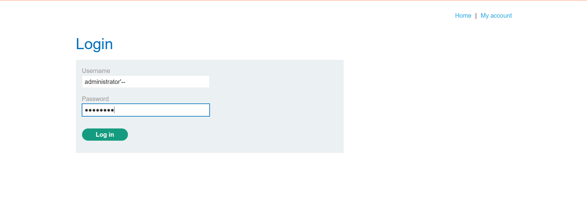

# SQL Injection: Authentication Bypass

## Overview

This lab demonstrates how improper handling of user-supplied input within an authentication mechanism can lead to a SQL injection vulnerability.

By manipulating the `username` parameter, it was possible to alter the logic of the underlying SQL query and authenticate as the `administrator` user without knowing the correct password.

---

## Lab Details

| Attribute  | Value                                             |
| ---------- | ------------------------------------------------- |
| Platform   | PortSwigger Web Security Academy                  |
| Category   | SQL Injection                                     |
| Lab        | SQL injection vulnerability allowing login bypass |
| Difficulty | Apprentice                                        |
| Status     | Completed ✅                                       |

---

## Objective

Identify and exploit a SQL injection vulnerability in a login form to gain unauthorized access to the `administrator` account.

---

## Vulnerability Description

The application failed to safely process user input supplied to the `username` field. User-controlled data was incorporated directly into the backend SQL query, enabling modification of the query logic.

Authentication systems are a common target for SQL injection attacks because successful exploitation can result in unauthorized access to privileged accounts and sensitive application functionality.

---

## Attack Surface

| Component                  | Description            |
| -------------------------- | ---------------------- |
| Endpoint                   | `/login`               |
| Method                     | `POST`                 |
| User-Controlled Parameters | `username`, `password` |

---

## Methodology

1. Accessed the application's login page.
2. Identified user-controlled input fields within the authentication form.
3. Tested the application's handling of special characters.
4. Observed that user input influenced backend query execution.
5. Modified the `username` parameter to alter authentication logic.
6. Successfully authenticated as the `administrator` user.

---

## Evidence

### Initial Login Interface

### Successful Authentication as Administrator

---

## Impact Assessment

If present in a production environment, this vulnerability could allow an attacker to:

* Bypass authentication controls
* Access privileged user accounts
* View or modify sensitive information
* Escalate privileges within the application
* Compromise application confidentiality and integrity

### Risk Rating

**Severity: High**

Authentication bypass vulnerabilities can lead to complete account compromise and unauthorized access to administrative functionality.

---

## Root Cause

The application constructed SQL queries using unsanitized user input instead of using parameterized statements.

As a result, user input was interpreted as part of the SQL command rather than as data.

---

## Remediation

Recommended mitigations include:

* Use parameterized queries (prepared statements)
* Implement server-side input validation
* Apply the principle of least privilege to database accounts
* Use secure coding frameworks and ORM libraries where appropriate
* Perform regular security testing and code reviews

---

## Key Takeaways

* User input should never be concatenated directly into SQL queries.
* Authentication workflows require strict input handling.
* Parameterized queries are the primary defense against SQL injection.
* Security testing should include validation of all user-controlled inputs.

---

## Disclaimer

This assessment was conducted exclusively within an authorized training environment provided by PortSwigger Web Security Academy for educational purposes.

